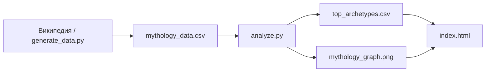

# ⚡ Сравнительная мифология: древо богов

> Что общего у культур, которые никогда не встречались?  
> Интерактивный исследовательский проект о сходствах в греческой, скандинавской и славянской мифологиях.

---

## 📖 О проекте

Древние народы жили в разных уголках мира, но их боги выполняли удивительно похожие роли: громовержец, богиня любви, хранитель мёртвых, мудрец-трикстер. Этот проект систематизирует такие соответствия с помощью Python и наглядно показывает их на веб-странице.

**Цель:** найти общие архетипы в трёх пантеонах, рассчитать коэффициент совпадения функций и построить интерактивное «древо богов».

---

## ✨ Возможности

| Модуль | Описание |
|--------|----------|
| **Сбор данных** | Генерация структурированного датасета или парсинг статей Википедии |
| **Анализ** | Группировка богов по функциям и расчёт коэффициента совпадения |
| **Визуализация** | Сетевой граф связей «культура → бог → функция» (NetworkX + Matplotlib) |
| **Веб-интерфейс** | Лендинг с карточками архетипов, каруселями, мини-игрой «Бросить руны» |

---

## 🛠 Технологии

**Backend (Python)**
- `pandas` — обработка табличных данных
- `networkx` — построение сетевого графа
- `matplotlib` — экспорт графа в PNG
- `requests` + `beautifulsoup4` — парсинг Википедии

**Frontend**
- HTML5 / CSS3 / JavaScript (Vanilla)
- Google Fonts: Cinzel, Montserrat
- Intersection Observer API, плавные карусели

---

## 📁 Структура проекта

```
mythology/
├── generate_data.py          # Генерация эталонного датасета
├── parser.py                 # Парсинг богов с Википедии
├── analyze.py                # Анализ архетипов и построение графа
├── mythology_data.csv        # Основной датасет (3 культуры)
├── parsed_mythology_data.csv # Сырые данные после парсинга
├── top_archetypes.csv        # Топ архетипов с коэффициентами
├── mythology_graph.png       # Сетевой граф (генерируется analyze.py)
├── index.html                # Главная страница
├── style.css                 # Стили
└── script.js                 # Интерактив: анимации, карусели, мини-игра
```

---

## 🚀 Быстрый старт

### 1. Клонирование и окружение

```bash
git clone <url-репозитория>
cd mythology

python -m venv venv

# Windows
venv\Scripts\activate

# Linux / macOS
source venv/bin/activate
```

### 2. Установка зависимостей

```bash
pip install pandas networkx matplotlib requests beautifulsoup4
```

### 3. Запуск пайплайна данных

```bash
# Шаг 1 — сформировать датасет
python generate_data.py

# Шаг 2 — проанализировать и построить граф
python analyze.py
```

> **Опционально:** для сбора «живых» данных с Википедии запустите `python parser.py`.  
> Результат сохранится в `parsed_mythology_data.csv`.

### 4. Открытие сайта

Откройте `index.html` в браузере — локально или через любой статический сервер:

```bash
python -m http.server 8000
# Перейдите на http://localhost:8000
```

---

## 🔬 Пайплайн обработки



1. **Сбор** — имена богов, культуры, функции и атрибуты попадают в CSV.
2. **Группировка** — боги объединяются по общим функциям (архетипам).
3. **Коэффициент совпадения** — доля культур, в которых встречается данная функция:

   ```
   коэффициент = количество_культур / 3
   ```

4. **Граф** — узлы трёх типов: культура, бог, функция; рёбра показывают принадлежность.
5. **Сайт** — результаты анализа оформлены в интерактивную презентацию.

---

## 📊 Ключевые результаты

| Архетип | Совпадение | Примеры богов |
|---------|:----------:|---------------|
| Громовержец | 100% | Зевс · Тор · Перун |
| Богиня любви | 100% | Афродита · Фрейя · Лада |
| Покровитель мёртвых | 100% | Аид · Хель · Марена |
| Бог мудрости | 100% | Гермес · Один · Велес |
| Божество судьбы | 67% | Норны · Макошь |

**Главный вывод:** несмотря на географическую изоляцию, древние культуры формировали схожие архетипы — отражение универсальной человеческой психологии и общих природных образов (гром, солнце, смерть, судьба).

---

## 🎮 Интерактив на сайте

- **Древо богов** — визуализация сетевого графа
- **Топ-5 архетипов** — карточки с процентом совпадения
- **Артефакты и символы** — горизонтальная карусель (Мьёльнир, веретено Макоши, копьё Гунгнир…)
- **Тайны мифологии** — мини-эссе о повторяющихся образах
- **Генератор архетипа** — «бросьте руны» и узнайте свой мифологический тип

---

## 📚 Контекст

Проект выполнен в рамках практики по программе **«Основы программирования на языке Python для лингвистов»**.

---

<p align="center">
  <sub>© 2026 · Команда проекта</sub>
</p>
