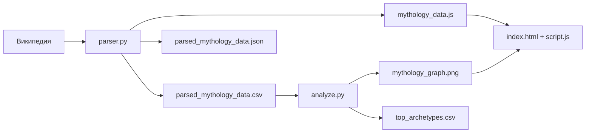

# ⚡ Сравнительная мифология: древо богов

> Что общего у культур, которые никогда не встречались?  
> Парсинг Википедии, визуализация связей и интерактивный сайт о греческой, скандинавской и славянской мифологиях.

---

## 📖 О проекте

Проект собирает данные о богах трёх культур **с Википедии**, сохраняет их в CSV/JSON, строит сетевой граф и выводит результат на веб-страницу.

**Цель:** показать, как разные народы описывали схожие божественные роли — и сделать это наглядно: карточки, карусель, граф и мини-игра.

---

## ✨ Возможности

| Модуль | Описание |
|--------|----------|
| **`parser.py`** | Парсинг статей Википедии (греческие, скандинавские, славянские боги) |
| **`analyze.py`** | Построение сетевого графа «культура → бог» (NetworkX + Matplotlib) |
| **`generate_data.py`** | Эталонный датасет вручную (резерв, если парсер недоступен) |
| **Сайт** | Карточки богов, фильтр по культурам, карусель, мини-игра «Бросить руны» |

---

## 🛠 Технологии

**Python:** `pandas`, `networkx`, `matplotlib`, `requests`, `beautifulsoup4`

**Frontend:** HTML5, CSS3, JavaScript (Vanilla), Google Fonts (Cinzel, Montserrat)

---

## 📁 Структура проекта

```
mythology/
├── parser.py                   # Парсинг Википедии → CSV + JS для сайта
├── analyze.py                  # Граф из спарсенных данных
├── generate_data.py            # Резервный эталонный датасет
├── requirements.txt            # Зависимости Python
│
├── parsed_mythology_data.csv   # Основной результат парсера
├── parsed_mythology_data.json  # JSON-копия
├── mythology_data.js           # Данные для сайта (window.mythologyData)
├── mythology_graph.png         # Сетевой граф
├── top_archetypes.csv          # Статистика по культурам
├── mythology_data.csv          # Эталон (generate_data.py), запасной для analyze.py
│
├── index.html                  # Главная страница
├── style.css                   # Стили
└── script.js                   # Рендер данных, карусели, мини-игра
```

---

## 🚀 Быстрый старт

### 1. Клонирование и окружение

```bash
git clone <url-репозитория>
cd mythology

python -m venv venv

# Windows
venv\Scripts\activate

# Linux / macOS
source venv/bin/activate
```

### 2. Установка зависимостей

```bash
pip install -r requirements.txt
```

### 3. Сбор данных и граф

```bash
# Шаг 1 — спарсить Википедию и обновить данные для сайта
python parser.py

# Шаг 2 — построить граф
python analyze.py
```

### 4. Запуск сайта на localhost

```bash
python -m http.server 8000
```

Откройте в браузере: **http://localhost:8000**

Остановка сервера: `Ctrl + C`

---

## 🔬 Пайплайн данных



### Что обновляет каждый скрипт

| Скрипт | Файлы на выходе | Что меняется на сайте |
|--------|-----------------|------------------------|
| `parser.py` | CSV, JSON, `mythology_data.js` | Карточки, карусель, статистика, мини-игра |
| `analyze.py` | `mythology_graph.png`, `top_archetypes.csv` | Только изображение графа |
| `generate_data.py` | `mythology_data.csv` | Ничего (используется как запасной источник) |

---

## 🌐 Как сайт получает данные

1. `parser.py` собирает богов с Википедии.
2. Результат записывается в `mythology_data.js`:
   ```js
   window.mythologyData = [{ культура, имя_бога, функция, ... }, ...];
   ```
3. `index.html` подключает этот файл.
4. `script.js` читает `window.mythologyData` и рисует интерфейс.

Сайт **не парсит** Википедию сам — он показывает последний слепок из `mythology_data.js`. Чтобы обновить данные, снова запустите `python parser.py` и обновите страницу.

---

## ✅ Проверка работоспособности парсера

После `python parser.py` в терминале должно быть примерно:

```
Успешно! Спарсено 84 богов.
  греческая: 15
  скандинавская: 41
  славянская: 28
```

Проверьте файлы:

| Файл | Что смотреть |
|------|--------------|
| `parsed_mythology_data.csv` | Таблица с колонками `культура`, `имя_бога`, `функция` |
| `mythology_data.js` | Непустой массив `window.mythologyData` |
| Сайт на localhost | Статистика «собрано N богов», карточки в разделе «Боги трёх пантеонов» |

---

## 📡 Источники парсера

| Культура | Страница Википедии | Раздел |
|----------|-------------------|--------|
| Греческая | [Олимпийские боги](https://ru.wikipedia.org/wiki/Олимпийские_боги) | «Список» |
| Скандинавская | [Асы](https://ru.wikipedia.org/wiki/Асы) | «Список асов» |
| Славянская | [Список славянских богов](https://ru.wikipedia.org/wiki/Список_славянских_богов) | таблицы + «Общепризнанная божественность» |

---

## 🎮 Интерактив на сайте

- **Древо богов** — сетевой граф из `mythology_graph.png`
- **Боги трёх пантеонов** — карточки из спарсенных данных, фильтр по культурам
- **Карусель богов** — все записи из датасета
- **Тайны мифологии** — статичные мини-эссе (не из парсера)
- **Бросить руны** — случайный бог из `mythologyData`

---

## 🐛 Частые проблемы

| Проблема | Решение |
|----------|---------|
| `ModuleNotFoundError: networkx` | `pip install -r requirements.txt` или активируйте `venv` |
| Пустые карточки на сайте | Запустите `python parser.py`, обновите страницу (`Ctrl+F5`) |
| Нет графа | Запустите `python analyze.py` после парсера |
| Парсер собрал мало записей | Проверьте интернет; разметка Википедии могла измениться |

---

## 📚 Контекст

Проект выполнен в рамках практики по программе **«Основы программирования на языке Python для лингвистов»**.

---

<p align="center">
  <sub>© 2026 · Команда проекта</sub>
</p>
